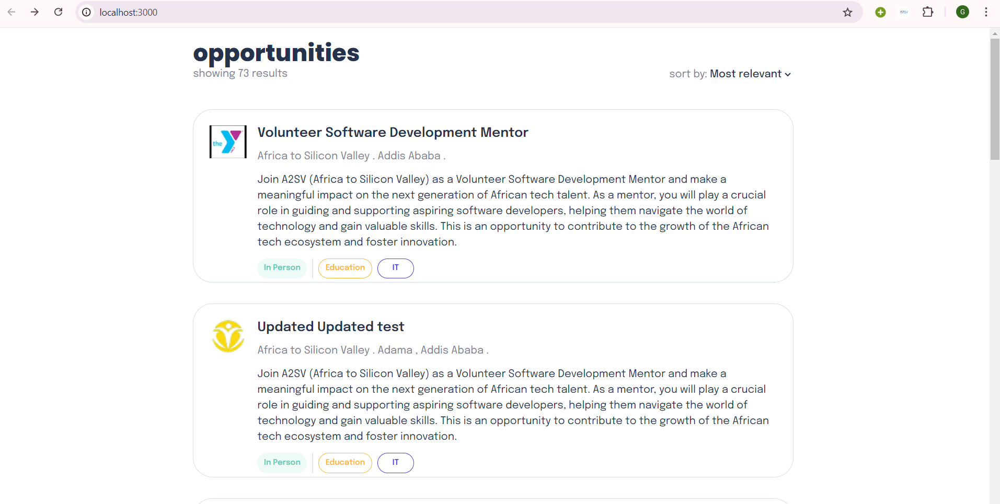
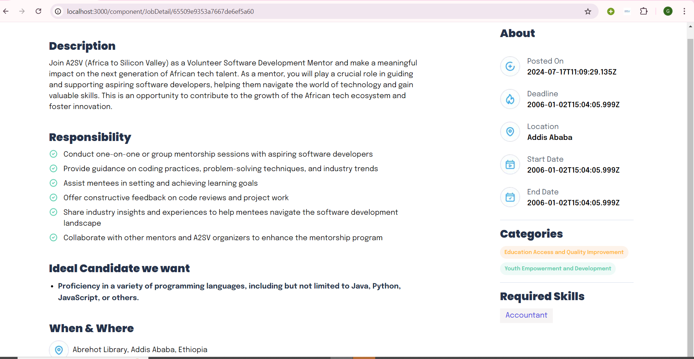

# Job Listing Application

## Overview

This project is a Job Listing Application built using NextJs ,RTK query and Tailwind CSS. It includes a job listing dashboard where users can view job cards, and when a user clicks on a job card, they are taken to a detailed description page of the selected job.

## Features

- **Job Listing Dashboard**: Displays a list of job cards with basic information.
- **Job Details Page**: Provides detailed information about a specific job when a user clicks on a job card.


## Screenshots

### Job Listing Dashboard



### Job Details Page




## Installation

1. **Clone the repository**:

   ```bash
   git clone https://github.com/Gadisa21/JobListing-app.git

2. **Navigate to the project directory**:

   ```bash
   cd joblisting
3. **npm install**:

   ```bash
   npm install
3. **Start the development server:**:

   ```bash
   npm run dev 
